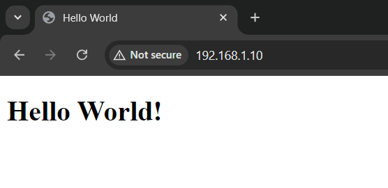
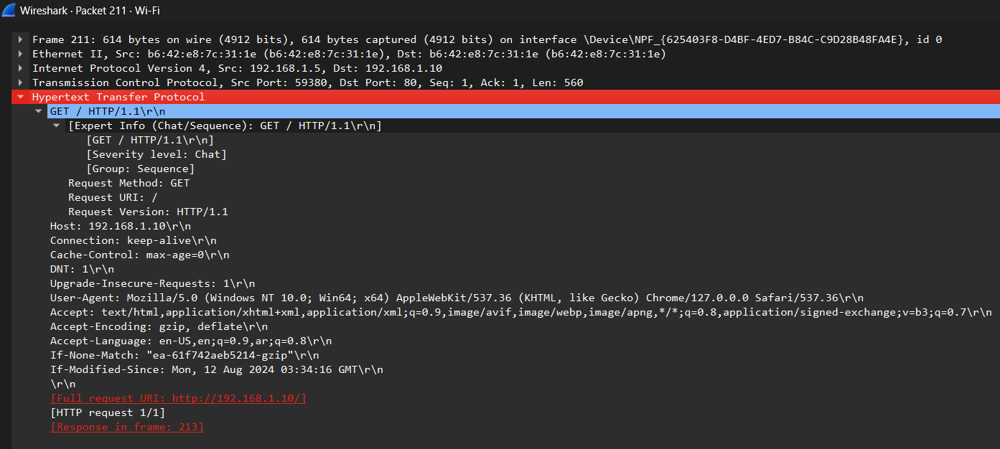

# **WebServe & Sniff: Building and Analyzing an Apache-Hosted Hello World Site**

## **Project Overview**
**"WebServe & Sniff"** is a hands-on project designed to help you understand the basics of setting up an Apache web server on Ubuntu, hosting a simple 'Hello World' webpage, and analyzing the HTTP protocol using Wireshark on a Windows machine. The project focuses on practical implementation and network traffic analysis, providing valuable insights into web server setup and network monitoring.

## **Table of Contents**
- [Project Overview](#project-overview)
- [Requirements](#requirements)
- [Setup Instructions](#setup-instructions)
  - [1. Setting Up Apache Web Server](#1-setting-up-apache-web-server)
  - [2. Accessing the Website from Windows](#2-accessing-the-website-from-windows)
  - [3. Analyzing HTTP Traffic with Wireshark](#3-analyzing-http-traffic-with-wireshark)
- [Deliverables](#deliverables)
- [Screenshots](#screenshots)
- [Conclusion](#conclusion)
- [Contact](#contact)

## **Requirements**
- **Operating Systems**:
  - Ubuntu (for hosting the web server)
  - Windows (for accessing the web server and analyzing traffic)
- **Software**:
  - Apache2 (web server software)
  - Wireshark (network protocol analyzer)
- **Network**:
  - Both machines must be on the same network.
  
## **Setup Instructions**

### **1. Setting Up Apache Web Server**
1. **Update Ubuntu Packages**:
   ```bash
   sudo apt-get update
   sudo apt-get upgrade
   ```
2. **Install Apache2**:
   ```bash
   sudo apt-get install apache2
   ```
3. **Start and Enable Apache**:
   ```bash
   sudo systemctl start apache2
   sudo systemctl enable apache2
   ```
4. **Create 'Hello World' HTML Page**:
   - Navigate to `/var/www/html/` and create `index.html`:
     ```bash
     cd /var/www/html
     sudo nano index.html
     ```
   - Add the following HTML content:
     ```html
     <!DOCTYPE html>
     <html lang="en">
     <head>
      <meta charset="UTF-8">
      <meta name="description" content="A simple Hello World example in HTML.">
      <title>Hello World</title>
     </head>
       <body>
       <h1>Hello World!</h1>
       </body>
     </html>
     ```
5. **Verify Server Accessibility**:
   - Find the Ubuntu server’s IP using:
     ```bash
     hostname -I
     ```
   - Open a browser on any machine connected to the same network and enter the Ubuntu server's IP address.

### **2. Accessing the Website from Windows**
1. **Find Ubuntu Server’s IP**:
   - Use `hostname -I` to find the IP address.
2. **Connect via Browser**:
   - Open a web browser on your Windows machine and enter the IP address. The 'Hello World' page should appear.

### **3. Analyzing HTTP Traffic with Wireshark**
1. **Install Wireshark**:
   - Download and install Wireshark from [here](https://www.wireshark.org/).
2. **Capture Network Traffic**:
   - Start a new capture on the network interface connected to your Ubuntu machine.
   - Access the 'Hello World' page from your Windows browser.
3. **Filter and Analyze HTTP Traffic**:
   - Use the `http` filter to isolate HTTP traffic.
   - Examine the HTTP GET requests and responses.

## **Deliverables**
- **Detailed Report**:
  - Steps and resources used for Apache server setup.
  - Insights and analysis from the HTTP traffic captured by Wireshark.
  - Challenges faced and how they were addressed.
- **Screenshots**:
  - The 'Hello World' webpage as viewed on Windows.
  - Wireshark capturing and analyzing HTTP traffic.

## **Screenshots**
1. **'Hello World' Webpage**:
   - 
2. **Wireshark HTTP Analysis**:
   - 

## **Conclusion**
This project provided hands-on experience with web server setup, website hosting, and HTTP traffic analysis. It enhanced understanding of the HTTP protocol and the importance of network monitoring tools like Wireshark.

## **Contact**
For any questions or feedback, please contact:
- **Name**: Mohamed Khaled Mahmoud Sayed
- **Email**: Mo7ammad244@gmail.com

## License

This project is licensed under the MIT License - see the [LICENSE](LICENSE) file for details.
